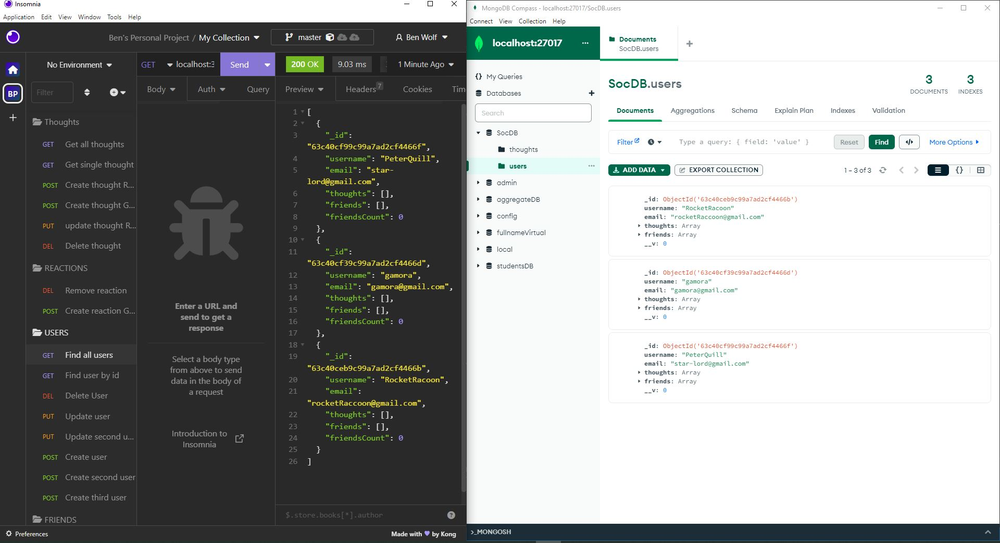

# NoSQL Challenge: Social Network API  Challenge-18
  
  ## Description
  Your challenge is to build an API for a social network web application where users can share their thoughts, react to friends’ thoughts, and create a friend list. You’ll use Express.js for routing, a MongoDB database, and the Mongoose ODM.
  

  
  
  
  ## Table of Contents
  1. [Installation](#installation)
  2. [Usage](#usage)
  3. [Contributing](#contributing)
  4. [Credits](#credits)
  5. [Tests](#tests)
  6. [License](#license)
  7. [Questions](#questions)
  
  ## Installation
   npm i express "^4.17.1"    
   npm i mongoose "^6.0.13"     
   npm i mongodb "^4.5.0"    
   npm i moment "^2.29.4"    
  devDependencies    
   npm i --save-dev nodemon  

  ## Usage
   npm run dev: "nodemon server.js"  
   npm run start: "node server.js"      
  -API  
  | GET localhost:3001/api/users/ | `GET all users` | GET localhost:3001/api/thoughts/ | `GET all thoughts` |  
  | GET localhost:3001/api/users/_id | `GET 1 user` | GET localhost:3001/api/thoughts/id *thoughts id | `GET 1 thought` |  
  | DELETE localhost:3001/api/users/_id | `DELETE 1 user` | DELETE localhost:3001/api/thoughts/id *thoughts id | `DELETE 1 thought` |  
  | PUT localhost:3001/api/users/_id | `UPDATE 1 user` | PUT localhost:3001/api/thoughts/id *thoughts id | `UPDATE 1 thought` |  
  | POST localhost:3001/api/users/ | `CREATE 1 user` | POST localhost:3001/api/thoughts/_id *users id | `CREATE 1 thought` |    

  | POST localhost:3001/api/thoughts/"thoughts"id/reactions | `CREATE Reaction` | DELETE localhost:3001/api/thoughts/"reaction"id | `DELETE Reaction` |     

  |POST localhost:3001/api/users/"users"_id/friends/"users"_id | `ADD Friend` | DELETE localhost:3001/api/users/"users"_id/friends/"friend" id | `DELETE Friend` |  
  
  

  
  ## Contributing
  To contribute please follow the link and read the contributing guide. https://github.com/github/docs/blob/dd9f70f9e7edb76e79fc43dee8fb3b8b8dfd1d20/CONTRIBUTING.md
  

  ## Credits
  https://devhints.io/moment  
  https://www.npmjs.com/package/express  
  https://www.npmjs.com/package/mongoose  
  https://www.npmjs.com/package/nodemon  
  https://www.w3schools.com/mongodb/  
  
  

  ## Tests
  N/A
  

  ## License
  Copycenter (c) [wolfjfly](https://github.com/wolfjfly). All centers reserved. 
  
Licensed under the [MIT license](https://choosealicense.com/licenses/mit/)
  

  ## Questions
  Feel free to contact me with questions or comments @:
  - GitHub: [wolfjfly](https://github.com/wolfjfly)
  - Email: [benjamin_wlf@yahoo.com](mailto:benjamin_wlf@yahoo.com)
  
  ## Deployed
    
  github   
  https://github.com/wolfjfly/social-network-API-challenge-18
